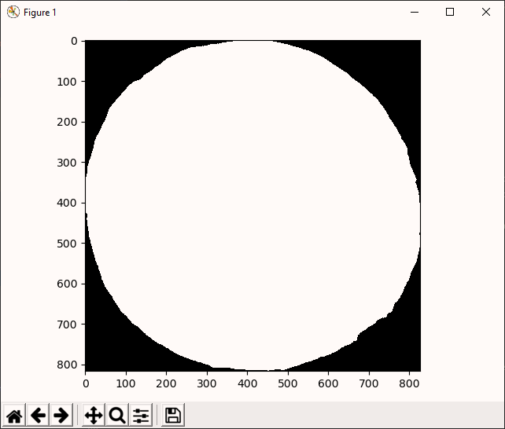

# pypiepi

For Kathy

## Summary

A library for everything you need to simulate pi on pictures of pies in Python.

## Example

#### The Long Version

For a perfect circle, we can simulate pi by plotting it within a square such that width = height = diameter, then
counting  the ratio of points randomly distributed throughout the square that fall within/without the circle. This
ratio is related to pi by solving the relationship between the area of the circle and the area of the square. See [this
GeeksforGeeks](https://www.geeksforgeeks.org/estimating-value-pi-using-monte-carlo/) article for an overview of the
algorithm.

Actual pies are rarely perfect circles since the dough is pinched, typically in a pattern, all around the circumference.
This pinching is also sometimes exaggerated when the pie is baked and those edges get all delicious and crispy.

Let's use pypiepi to test how circular and pie-like and an actual pie is! Consider the example using `data/pi-pie.jpg`:


1. Download and unzip the project to a directory, and with a terminal or CMD window inside that directory, install using
pip:

```BatchFile
> pip install .
```

2. Import the package into a Python console along with a function for displaying results:

```python
>>> import pypiepi as ppp
>>> from skimage.io import imshow
>>> import matplotlib.pylot as plt
```

3. You'll need to use the path to the picture you want to work with quite a bit, so go ahead and save that to a
variable:

        >>> my_pie = 'data/pi-pie.jpg'

    Before we can simulate anything, we need to define where in the image the pie is. This process is called
    **segmentation**. `pypiepi` has both a manual and automatic method for this. Let's try both.

4. The manual method uses **superpixels** to make segmenting the pie easy and quick. Open the superpixel painter using
a variable, such as `manual_mask`, so that the mask you create can be used later:

        >>> manual_mask = ppp.segment_pie_manual(my_pie)
    
    A window pops up that allows you to:
    - Define parameters for the
    [SLIC superpixel algorithm](https://scikit-image.org/docs/dev/api/skimage.segmentation.html#skimage.segmentation.slic)
    - Paint the superpixels you want by dragging the left mouse button
    - Erase superpixels by dragging the right mouse button
    - Fill in a contour by clicking the middle mouse button
    - Clear the mask using the "Clear" button
    
    
    
    Once you've made your pie mask, close the window and the mask is returned to the variable you set. In this case,
    our mask ends up in `manual_mask`

5. The automatic method uses a Hough transform to detect the most prominent circle in the image, then seeds a watershed
from that circle. This does require two inputs: `radius` and `radius width`. There's an app for that!

        >>> ppp.measure_radius(my_pie)
    
    A window pops up that allows you to:
    - Left click to define the center
    - Right click to define a point along the outer edge
    - Calculate the radius (automatic)
    
    
    
    From this we see that our pie has a radius of ~410 pixels, but that it varies by about 20 pixels. Using these
    measurements, we can automatically segment the pie and make another mask:
    
        >>> automatic_mask = ppp.segment_pie_auto(my_pie, radius=400, radius_width=20)
    
6. Let's look at our masks so far and compare:

        >>> imshow(manual_mask)
        >>> plt.show()
    
    
    
        >>> imshow(automatic_mask)
        >>> plt.show()
    
    

7. This entire simulation depends on the assumption that the diameter of the approximate circle (the pie mask) and the
length of the sides of the square it's inscribed withing (the image boundary) are equal, but that isn't yet so for these
images! Thus, we need to crop the images so that the boundaries are equal to the extents of the pies:

        >>> manual_mask = ppp.just_the_pie(manual_mask)
        >>> imshow(manual_mask)
        >>> plt.show()
    
    
    
        >>> automatic_mask = ppp.just_the_pie(automatic_mask)
        >>> imshow(manual_mask)
        >>> plt.show()
    
    

8. We now have all we need to simulate pi. There are two ways to do this in `pypiepi`. First, we'll calculate pie very
quickly using a vectorized method. This is straightforward:

        # The manual mask is currently RGB, so we can extract only one of the channels for simulation:
        >>> ppp.calculate_pi(manual_mask[:,:,0])
        3.158192291703783
        >>> ppp.calculate_pi(automatic_mask)
        3.116325571153972
    
    The returned values will vary slightly each time, but should be close to these. Congrats! You've simulated pie on a
    pie in Python.

9. Wasn't that a letdown? All that work for just a single number? Luckily `pypiepi` has a cooler way to simulate pi.
To do that, let's throw away all these fancy numpy methods for vectorizing arrays and making things fast, and go back
to the good 'ol FORTRAN days of printing a bunch of hacker-looking garbage to the console while watching a simulation
slowly converge:

        >>> manual_sim = ppp.SimulatePi(manual_mask[:,:,0], histories=314, criterion=0.0314, verbose=True)
        >>> manual_sim.run()
        History | Convergence | pi
        1 | 3.141592653589793 | 0.0
        2 | 3.141592653589793 | 0.0
        3 | 1.8082593202564599 | 1.3333333333333333
        4 | 1.1415926535897931 | 2.0
        5 | 0.7415926535897932 | 2.4
        6 | 0.4749259869231266 | 2.6666666666666665
        7 | 0.2844497964469359 | 2.857142857142857
        8 | 0.14159265358979312 | 3.0
        9 | 0.030481542478681956 | 3.111111111111111
    
    Much cooler! For a more accurate simulation, try using more histories or a lower convergence criterion. Note,
    however, that the more a pie deviates from a true circle, the larger your convergence tolerance will need to be
    to allow the simulation to converge.
    
10. Finally, to see an illustration of the points that were randomly placed inside/outside the pie for this simulation,
    show the simulation image:
    
        >>> automatic_sim = ppp.SimulatePi(manual_mask[:,:,0], histories=3141, criterion=0.00000314, verbose=True)
        >>> automatic_sim.run()
        History | Convergence | pi
        1 | 0.8584073464102069 | 4.0
        2 | 0.8584073464102069 | 4.0
        3 | 0.4749259869231266 | 2.6666666666666665
        ...
        3139 | 0.033940955839961706 | 3.175533609429755
        3140 | 0.03420352475415589 | 3.175796178343949
        3141 | 0.03446592648024849 | 3.1760585800700416
        >>> imshow(sim.simulation_image)
        >>> plt.show()
    
    

#### TL;DR

1. Download from Github, unzip to a directory, then navigate to that directory in a terminal or CMD window:

        pip install .

2. Import pypiepi, segment and crop a pie automatically, then simulate pi on it:

        import pypiepi as ppp
        my_pie = 'data/pi-pie.jpg'
        automatic_mask = ppp.segment_pie_auto(my_pie, radius=400, radius_width=20)
        automatic_mask = ppp.just_the_pie(automatic_mask)
        print(f"\nSimple pi calculation: {ppp.calculate_pi(automatic_mask)}")
        sim = ppp.SimulatePi(automatic_mask, histories=314, criterion=0.00314, verbose=True)
        print(f"\nRobust pi simulation:")
        sim.run()

## Attributions
- All images in data/ are from [Pixabay](https://pixabay.com) and are part of the [public domain](https://pixabay.com/service/license/).
    - pi-pie.jpg: Image by [Andrew Martin](https://pixabay.com/users/aitoff-388338)
    - cherry-pie.jpg: Image by [skeeze](https://pixabay.com/users/skeeze-272447)
    - oblique-cake.jpg: Image by [俊哉 佐伯](https://pixabay.com/users/la-fontaine-22289)
    - gold-coin.jpg: Image by [Tim C. Gundert](https://pixabay.com/users/timcgundert-3157574)
